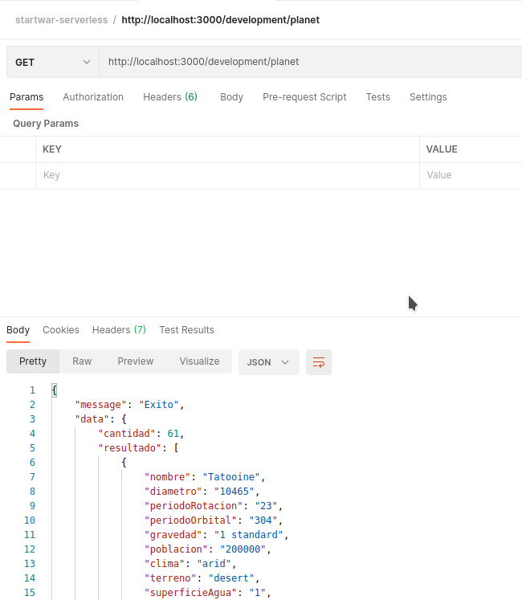

# startwar-serverless

## Enviroment requirement
	
	node v12
	npm

    AWS dynamoDB

## Install

Before to install you must be create your AWS account : [https://aws.amazon.com/](https://www.serverless.com/framework/docs/providers/aws/guide/credentials/)

    $ git clone project
    $ cd project
    $ npm install

## Running the app

    $ npm start

## Test

    $ npm test

## Deploy the app
	
    $ sls deploy

## Others

If you need use POSTMAN for create more elemenst use our collection. it was created in: `README/POSTMAN/` directory [download here](README/POSTMAN/startwar-serverless.postman_collection.json)

## Img reference

